<div align="center">

# 또바바 (ttobaba)

**또 사기 전에 또바!**

데이터 기반 심리 분석으로 현명한 의류 쇼핑을 돕는 초개인화 의사결정 솔루션


</div>

## 📖 프로젝트 소개

**또바바**는 패션 아이템을 사야 할지 말아야 할지 결정하지 못하는 사람들을 위한 앱입니다.

쇼핑몰 상품 링크를 입력하면, 사용자의 **쇼핑 성향(S-BTI)** 과 취향을 학습한 AI 캐릭터 **또바**가 채팅으로 함께 고민해 줍니다. 충동구매를 줄이고, 진짜 나에게 맞는 소비를 도와줍니다.

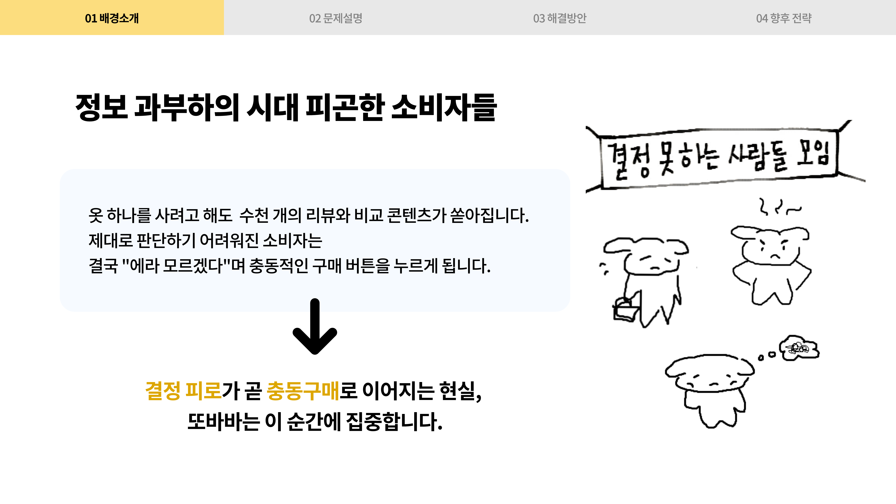
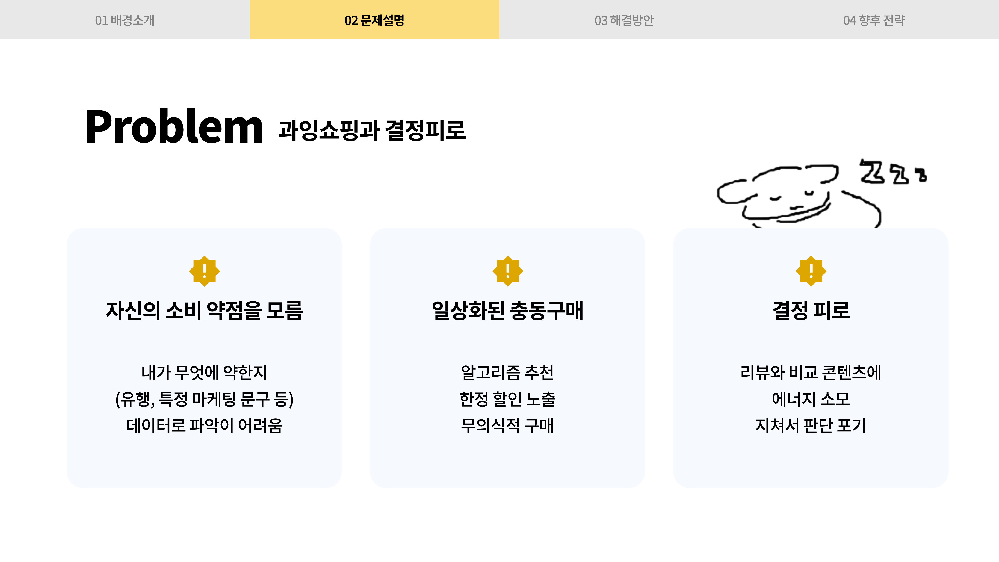

기존 커머스 AI가 판매 극대화를 위해 소비를 촉진한다면, 또바바는 사용자의 편에서 합리적인 소비 통제를 돕는 '지능적 선택 보조' 역할을 수행합니다.

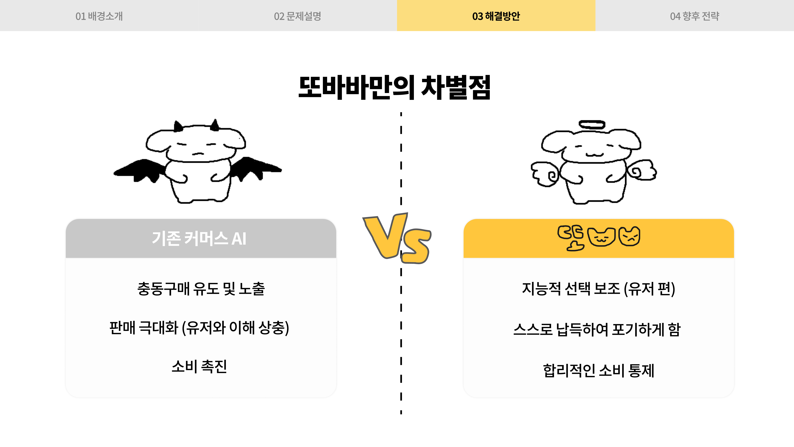

## ✨ 주요 기능

### 🐱 AI 또바와의 채팅
상품 링크를 입력하고, AI와 대화하며 구매 여부를 함께 결정합니다.

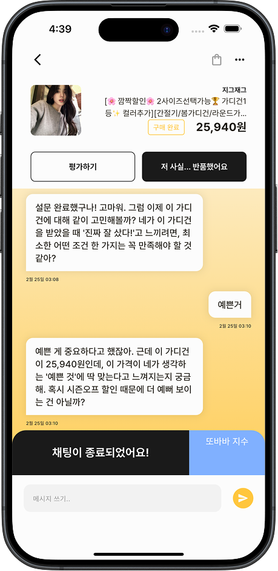

위험 점수와 선호도 점수를 종합하여 '구매 후회 예측 확률'을 정량화된 지수로 보여줍니다.

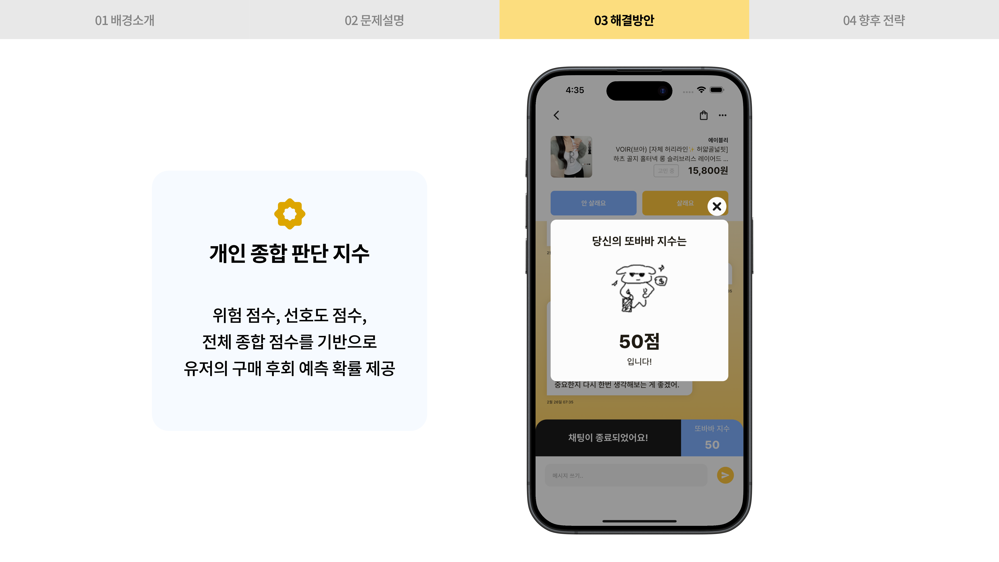

### 🛍️ S-BTI — 쇼핑 성향 테스트
6개 심리축을 기반으로 한 초개인화 소비 패턴 엔진입니다. 70명의 MVP 설문을 통해 유형별 분포와 특성을 검증하여 정교한 조언을 제공합니다.

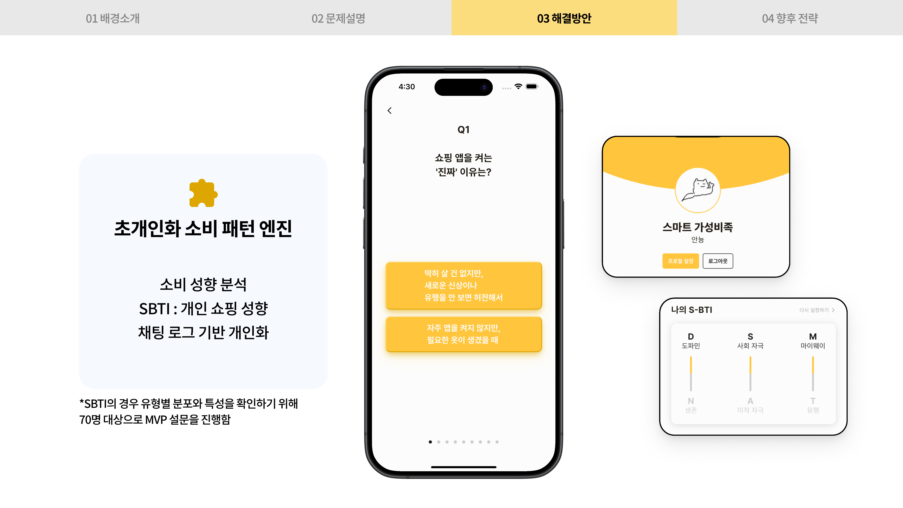

### 🏠 홈 화면 — 3가지 탭

| 탭 | 설명 |
|----|------|
| **또바와 진대** | AI 또바와의 최근 대화 및 추천 |
| **결정했나요?** | 아직 구매 결정을 내리지 않은 의류 목록 |
| **안 산 영수증** | 포기한 의류로 절약한 내역 영수증 |

<!-- 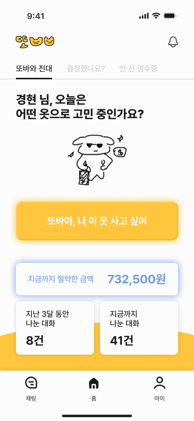
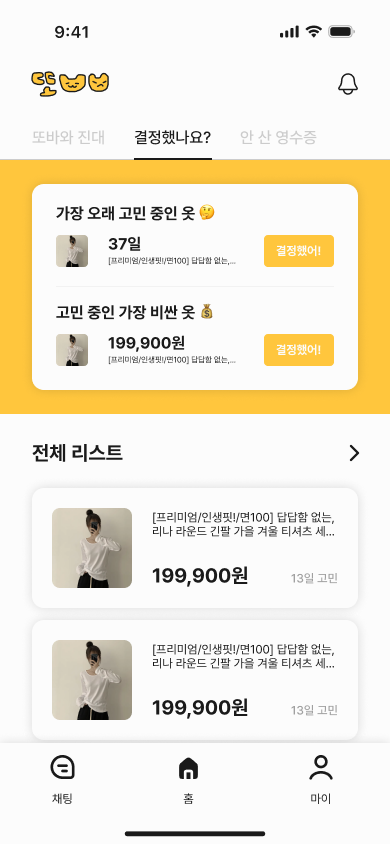
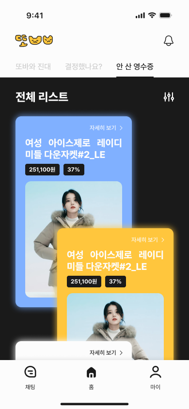
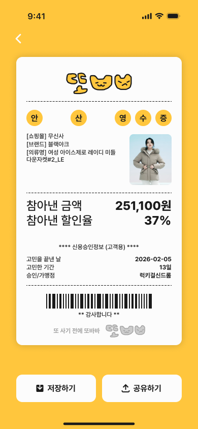 -->

<table width="100%">
  <tr>
    <td align="center" width="50%"><b>홈 화면</b></td>
    <td align="center" width="50%"><b>결정했나요?</b></td>
  </tr>
  <tr>
    <td></td>
    <td></td>
  </tr>
  <tr>
    <td align="center"><b>안 산 영수증 리스트</b></td>
    <td align="center"><b>안 산 영수증 상세</b></td>
  </tr>
  <tr>
    <td></td>
    <td></td>
  </tr>
</table>

### 👤 마이페이지
- 나의 S-BTI 결과 카드
- 자주 이용하는 쇼핑몰 & 추구미(스타일) 취향
- **나의 옷장**: 고심 끝에 구매한 옷 / 아쉽지만 포기한 옷 통계

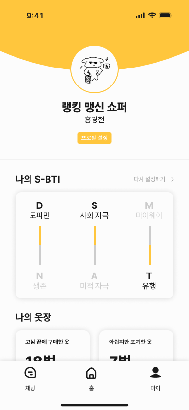

## 🧠 듀얼 스코어링 엔진

또바바는 독자적인 알고리즘을 통해 사용자의 소비 심리를 분석합니다.

### 1. 듀얼 스코어링 시스템
* **Impulse Score (구매욕 자극 지수)**: Gaussian Peak 모델 등 비선형 자극 모델링을 활용하여 구매 심리 압박감을 수치화합니다.
* **Preference Score (상품 선호 지수)**: 개인 취향과 집단 데이터를 결합하고 이력 거리(Regret/Like Gap)를 분석하여 실제 선호 가능성을 예측합니다.

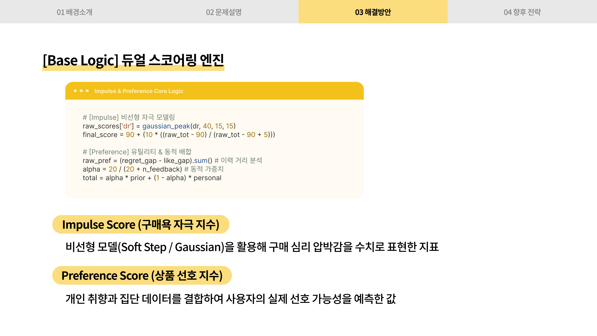

### 2. 최종 또바바 지수
상품 충동성, 사용자 선호도, 그리고 대화 맥락 분석 보정치(Chat CODE)를 최종 결합하여 쇼핑 위험도를 정량화합니다.
* **[CODE:C1]**: 강한 긍정 - 리스크 검증 완료
* **[CODE:W1/W2]**: 부정 - 후회 리스크 뚜렷

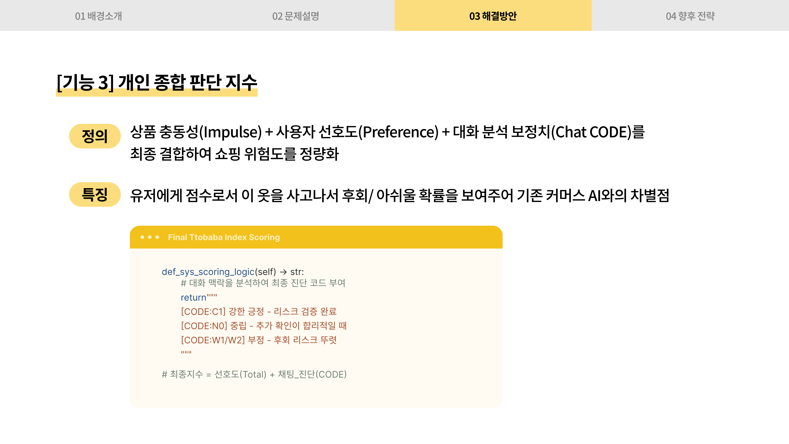

## 🏗️ 서비스 아키텍처

데이터 확보부터 LLM 실행 엔진까지의 전체 파이프라인은 다음과 같습니다.

1. **데이터 확보**: 상품 링크 분석 및 6개 심리축 기반 키워드 분류
2. **전략 수립**: Impulse/Preference Score 기반으로 BRAKE 또는 DECIDER 모드 결정
3. **LLM 챗봇 실행**: 전략 프로토콜에 따른 인지 활성화 및 최종 행동 제안(Action Plan)

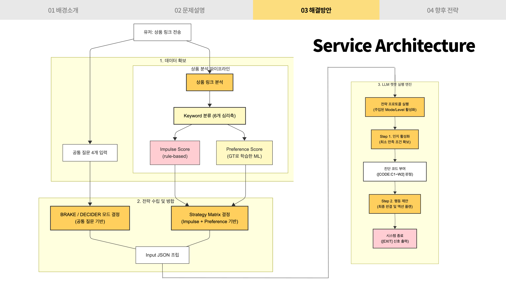

## 🔧 기술 스택

| 구분 | 기술 |
|------|------|
| 프레임워크 | Flutter (Dart, SDK `>=3.0.0 <4.0.0`) |
| 상태관리 | Riverpod 2.x (`flutter_riverpod`, `riverpod_generator`) |
| 라우팅 | `go_router` 13.x |
| 네트워크 | `dio` 5.x |
| 인증 | `flutter_secure_storage` (JWT 토큰 로컬 저장) |
| 모델 직렬화 | `freezed` + `json_serializable` |
| 폰트 | Pretendard |
| 배포 | Firebase Hosting (웹)
| 지원 플랫폼 | Android · iOS · Web |

## 🗂️ 프로젝트 구조

```
lib/
├── core/                   # 공통 인프라
│   ├── auth/               # 인증 상태 관리
│   ├── network/            # Dio HTTP 클라이언트
│   ├── router/             # GoRouter + 인증 기반 리다이렉션
│   ├── theme/              # 색상, 텍스트 스타일
│   ├── utils/              # 유틸 함수
│   └── widgets/            # 공통 위젯
│
└── features/               # 기능별 모듈
    ├── chat/               # AI 채팅 (핵심)
    ├── home/               # 홈 화면
    ├── sbti/               # S-BTI 쇼핑 성향 테스트
    ├── initial_question/   # 초기 취향 설문
    ├── my_page/            # 마이페이지
    ├── login/              # 로그인
    ├── signup/             # 회원가입
    ├── splash/             # 스플래시
    ├── products/           # 상품 관련
    ├── feedback/           # 피드백
    └── onboarding/         # 온보딩
```

각 feature는 `models / providers / repositories / screens / widgets` 구조를 따릅니다.

## 🚀 시작하기

### 사전 요구사항

- [Flutter SDK](https://docs.flutter.dev/get-started/install) `>=3.0.0`
- Dart `>=3.0.0`

### 설치 및 실행

```bash
# 1. 저장소 클론
git clone <repo-url>
cd front-end

# 2. 패키지 설치
flutter pub get

# 3. 코드 생성 (freezed, riverpod_generator)
dart run build_runner build --delete-conflicting-outputs

# 4. 앱 실행
flutter run
```

### 개발 팁

```bash
# 앱 시작 시 로그인 토큰을 초기화하고 싶을 때 (디버그 전용)
flutter run --dart-define=CLEAR_TOKEN_ON_START=true
```

## 📦 배포

| 플랫폼 | 방법 |
|--------|------|
| **Firebase Hosting** | `firebase deploy` |
| **Vercel** | `vercel --prod` |

> 웹 빌드 시 최대 너비 **480px**로 제한되어 모바일 UI에 최적화됩니다.

## 📱 화면 흐름

```
스플래시
  ├── 비로그인 → 로그인 / 회원가입 → S-BTI → 초기 취향 설문 → 홈
  └── 로그인 → 홈
         ├── 채팅 목록 → (링크 입력) → 채팅 설문 → AI 채팅
         ├── 홈 (또바와 진대 / 결정했나요? / 안 산 영수증)
         └── 마이페이지
```
